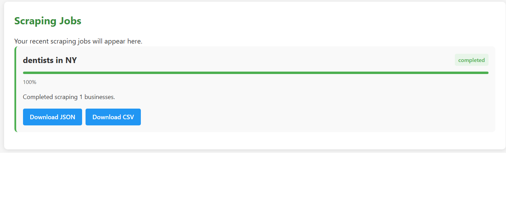
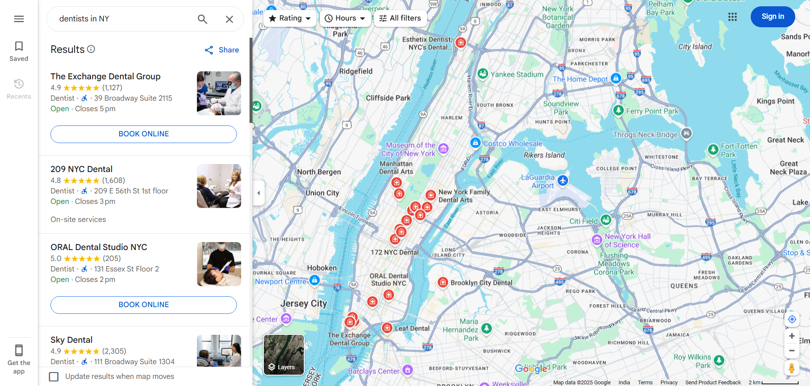

# LeadHarvest

LeadHarvest is a powerful tool designed to help sales teams, marketing agencies, and businesses find and connect with potential clients. It scrapes Google Maps for business information, finds email addresses, and generates personalized cold email templates.

## Features

- **Smart Google Maps Scraping**: Extracts business information including name, address, phone number, website, and ratings.
- **Website Detection**: Automatically identifies business websites from Google Maps listings.
- **Email Finding**: Discovers business email addresses from their websites.
- **Email Template Generation**: Creates personalized cold email templates based on the business information.
- **Easy Data Management**: Export leads in CSV, JSON, and Excel formats.
- **Responsive Design**: Works on both desktop and mobile devices.
- **User-friendly Interface**: Simple and intuitive interface for easy navigation.

## Installation

### Prerequisites
- Python 3.8 or higher
- Google Chrome browser
- Git

### Windows Installation
1. Clone the repository:
   ```
   git clone https://github.com/yourusername/lead_harvest.git
   cd lead_harvest
   ```

2. Create and activate a virtual environment:
   ```
   python -m venv leadenv
   .\leadenv\Scripts\activate
   ```

3. Install the required packages:
   ```
   pip install -r requirements.txt
   ```

4. (Optional) Set up OpenAI API key for AI-powered email generation:
   - Create a `.env` file in the root directory
   - Add your OpenAI API key: `OPENAI_API_KEY=your_api_key_here`

### macOS/Linux Installation
1. Clone the repository:
   ```
   git clone https://github.com/yourusername/lead_harvest.git
   cd lead_harvest
   ```

2. Create and activate a virtual environment:
   ```
   python -m venv leadenv
   source leadenv/bin/activate
   ```

3. Install the required packages:
   ```
   pip install -r requirements.txt
   ```

4. (Optional) Set up OpenAI API key for AI-powered email generation:
   - Create a `.env` file in the root directory
   - Add your OpenAI API key: `OPENAI_API_KEY=your_api_key_here`

## Usage

1. Activate your virtual environment:
   - Windows: `.\leadenv\Scripts\activate`
   - macOS/Linux: `source leadenv/bin/activate`

2. Start the application:
   ```
   cd lead_harvest
   python -m api.main
   ```
   
   **Note for Windows PowerShell users:** Use semicolon (`;`) instead of ampersand (`&&`):
   ```
   cd lead_harvest; python -m api.main
   ```

3. Open your browser and navigate to `http://127.0.0.1:8000/app`

4. Enter the type of business you're looking for (e.g., "coffee shops") and the location (e.g., "New York")

5. Choose the maximum number of results you want to scrape

6. Click "Start Scraping" and wait for the results

7. Once complete, you can download your leads in JSON, CSV, or Excel format

## Demo

### Home Screen


The home screen allows you to enter the business type and location you want to search for. You can also select the maximum number of results and choose whether to find email addresses and generate email templates.

### Results Page


After scraping is complete, you can view all businesses found and download the data in multiple formats (JSON, CSV, Excel).

## Troubleshooting

### ChromeDriver Issues
- Make sure Google Chrome is installed on your system
- If you encounter ChromeDriver errors (like "WinError 193: %1 is not a valid Win32 application"), try updating your Chrome browser to the latest version
- For persistent ChromeDriver issues, check that the Chrome version matches the ChromeDriver version
- You may need to manually download a compatible ChromeDriver version from the [ChromeDriver website](https://chromedriver.chromium.org/downloads)

### Google Maps Consent/Captcha
- If the scraper gets stuck on a consent screen or captcha, you may need to:
  1. Run the application locally
  2. Manually solve the captcha once in your browser
  3. Then restart the scraping process

### Server Start Issues
- On Windows PowerShell, use semicolon (`;`) instead of double ampersand (`&&`) for command chaining:
  ```
  cd lead_harvest; python -m api.main
  ```
- If the server fails to start, check if port 8000 is already in use by another application

### Connection Issues
- If you can't connect to the application, ensure you're using `http://127.0.0.1:8000/app` and not `http://localhost:8000/app`
- Check your firewall settings to make sure the application is allowed to access the internet

## Project Structure

```
lead_harvest/
│
├── api/ - FastAPI server and endpoints
│   ├── main.py - Main API entry point
│
├── frontend/ - Frontend files (HTML, CSS, JavaScript)
│   ├── index.html - Main HTML file
│   ├── app.js - JavaScript for the frontend
│   ├── style.css - CSS styles
│
├── scraper/ - Web scraping modules
│   ├── maps_scraper.py - Google Maps scraping functionality
│   ├── email_finder.py - Email finding functionality
│
├── utils/ - Utility functions
│   ├── email_generator.py - Email template generation
│
├── docs/ - Documentation
│   ├── images/ - Screenshots for documentation
│
├── requirements.txt - Project dependencies
├── requirements-full.txt - Complete environment dependencies
├── LICENSE - MIT License file
└── README.md - This file
```

## License

This project is licensed under the MIT License - see the LICENSE file for details.

## Disclaimer

LeadHarvest is intended to be used responsibly and ethically. Always respect website terms of service, robots.txt files, and rate limits. The tool is designed for legitimate business purposes only, such as market research and lead generation. Users are responsible for complying with all applicable local, state, and federal laws regarding data collection and usage. 